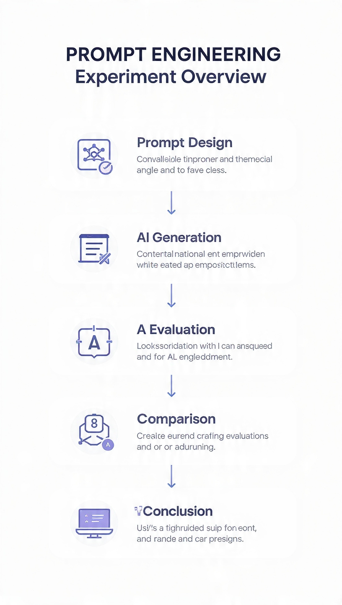
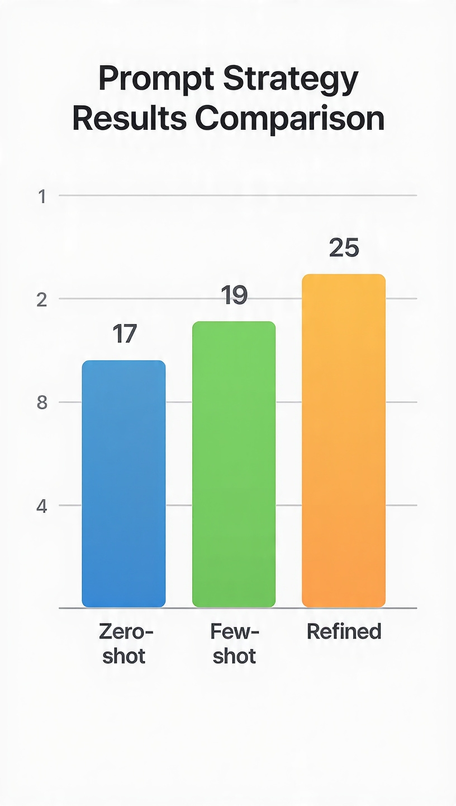
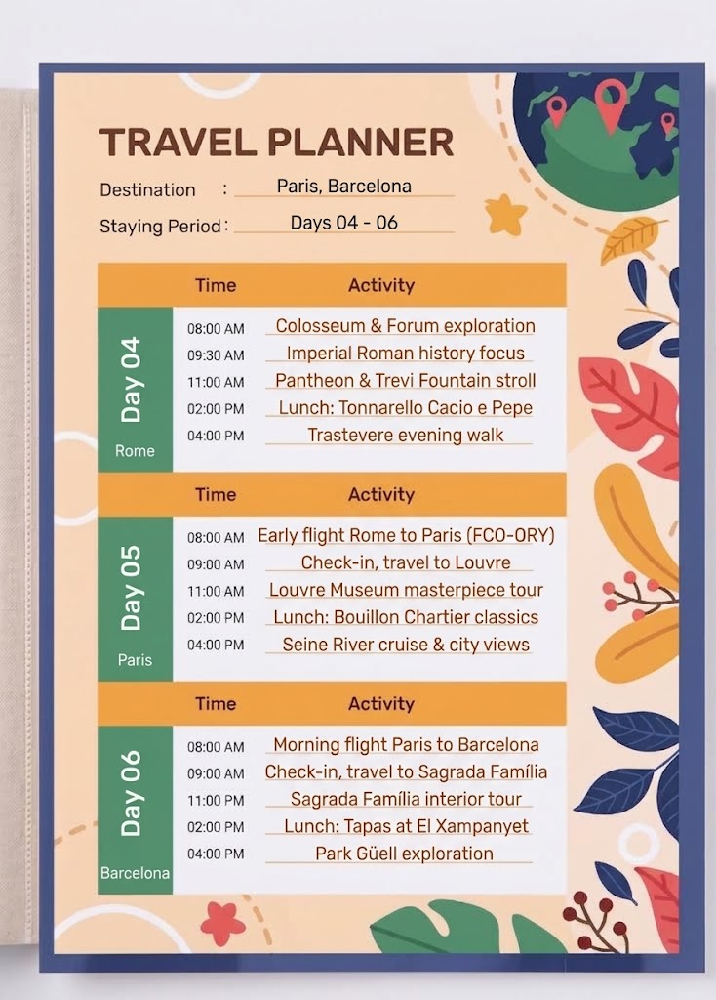
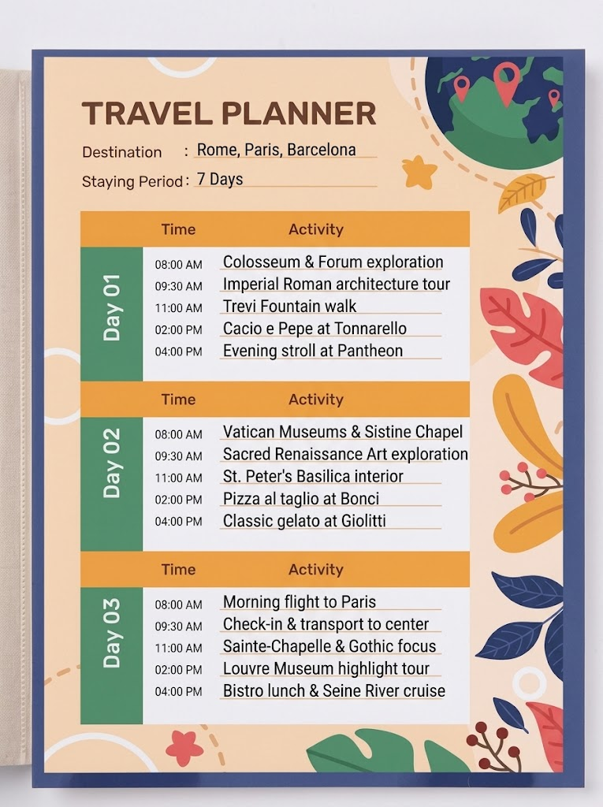

🧪 Prompt Engineering Lab

How Prompt Design Affects Generative AI Output Quality

  

  
  
  
  

---

🧠 What Is This Project?

This repository is a controlled Prompt Engineering experiment designed to investigate one central question:

«How does prompt design affect the quality of Generative AI output?»

The experiment uses the same task, same conditions, same AI model, and same evaluation criteria while changing only the prompting strategy.

                         SAME TASK
                            │
                            ▼
                ┌─────────────────────┐
                │   Prompt Strategy   │
                └──────────┬──────────┘
                           │
           ┌───────────────┼───────────────┐
           ▼               ▼               ▼
      ZERO-SHOT         FEW-SHOT        REFINED
           │               │               │
           ▼               ▼               ▼
        OUTPUT           OUTPUT           OUTPUT
           │               │               │
           └───────────────┼───────────────┘
                           ▼
                  EVALUATION & SCORING
                           │
                           ▼
                    RESULT COMPARISON
                           │
                           ▼
                       CONCLUSION

---

🎯 Project Goal

The goal is not simply to create a good prompt.

The goal is to experimentally determine whether changing prompt design changes the quality of the resulting AI output.

We compare:

Zero-shot
    ↓
Direct Instruction

Few-shot
    ↓
Instruction + Examples

Refined
    ↓
Role + Context + Task + Constraints
+ Output Format + Quality Criteria

---

🔬 Research Question

«How does prompt design affect the relevance, completeness, structure, constraint adherence, and usefulness of Generative AI output?»

---

🧪 Hypothesis

«Increasing prompt structure, contextual information, examples, constraints, and output requirements may improve the quality of Generative AI responses.»

The hypothesis is tested using actual generated outputs and a predefined evaluation framework.

---

🌍 Use Case

7-Day Cultural Trip Planner

The AI model is asked to generate a practical 7-day cultural travel plan covering:

🇮🇹 Italy
🇫🇷 France
🇪🇸 Spain

Target User

Attribute| Value
Trip Type| Cultural
Duration| 7 Days
Budget| Medium
Target User| Young Adult Traveler
Interests| History
Interests| Museums
Interests| Local Food
Interests| Architecture

---

🖼️ Visual Explanation

  

«The visual above summarizes the entire experiment from prompt design → AI generation → evaluation → comparison → conclusion.»

Recommended Asset

Create:

assets/
└── images/
    └── experiment-overview.svg

This image should visually contain:

              PROMPT ENGINEERING LAB

       ┌──────────────┐
       │  ZERO-SHOT   │
       └──────┬───────┘
              │
              ▼
           OUTPUT
              │
              │
       ┌──────────────┐
       │   FEW-SHOT   │
       └──────┬───────┘
              │
              ▼
           OUTPUT
              │
              │
       ┌──────────────┐
       │   REFINED    │
       └──────┬───────┘
              │
              ▼
           OUTPUT
              │
              ▼
       ┌──────────────┐
       │  EVALUATION  │
       └──────┬───────┘
              │
              ▼
          COMPARISON
              │
              ▼
         CONCLUSION

---

🧩 Experiment Design

To make the comparison fair, the following variables remain constant:

Variable| Value
Use Case| 7-day cultural trip
Destinations| Italy, France, Spain
Budget| Medium
Target User| Young Adult Traveler
Interests| History, Museums, Local Food, Architecture
AI Model| Same model for all tests
Input Conditions| Same conditions
Evaluation Criteria| Same criteria
Experimental Variable| Prompt Strategy

Experimental Logic

flowchart TD
    A["Same Use Case"] --> B["Prompt Strategy"]

    B --> C["Zero-shot"]
    B --> D["Few-shot"]
    B --> E["Refined"]

    C --> F["AI Output"]
    D --> G["AI Output"]
    E --> H["AI Output"]

    F --> I["Evaluation"]
    G --> I
    H --> I

    I --> J["Comparison"]
    J --> K["Reflection"]
    K --> L["Conclusion"]

---

🔄 Experiment Pipeline

flowchart LR
    A["Define Use Case"] --> B["Design Prompts"]
    B --> C["Run AI Tests"]
    C --> D["Save Outputs"]
    D --> E["Evaluate"]
    E --> F["Compare"]
    F --> G["Reflect"]
    G --> H["Present"]
    H --> I["Final QA"]
    I --> J["Submission"]

---

🧠 Prompt Strategies

01 — Zero-shot

The AI receives the task directly without examples.

Purpose

Establish a baseline.

Task
  ↓
AI
  ↓
Output

📄 File:

""prompts/zero-shot.md"" (prompts/zero-shot.md)

---

02 — Few-shot

The AI receives examples before solving the target task.

Purpose

Test whether examples improve the model's understanding of:

- expected structure
- response style
- level of detail
- output pattern

Examples
    ↓
Task
    ↓
AI
    ↓
Output

📄 File:

""prompts/few-shot.md"" (prompts/few-shot.md)

---

03 — Refined Prompt

The prompt explicitly defines:

Role
 ↓
Context
 ↓
Task
 ↓
Constraints
 ↓
Output Format
 ↓
Quality Criteria

Purpose

Test whether explicit instructions provide greater control over:

- Relevance
- Completeness
- Structure
- Constraint Adherence
- Usefulness

📄 File:

""prompts/refined.md"" (prompts/refined.md)

---

🎬 Prompt Evolution

The experiment can be viewed as a progression in prompt specificity:

flowchart LR
    A["Zero-shot Simple Instruction"]
    --> B["Few-shot Instruction + Examples"]
    --> C["Refined Context + Constraints + Format"]

Conceptual Progression

Less Control
     │
     ▼
┌──────────────┐
│  ZERO-SHOT   │
│              │
│ Direct Task  │
└──────┬───────┘
       │
       ▼
┌──────────────┐
│   FEW-SHOT   │
│              │
│ Task +       │
│ Examples     │
└──────┬───────┘
       │
       ▼
┌──────────────┐
│   REFINED    │
│              │
│ Role         │
│ Context      │
│ Task         │
│ Constraints  │
│ Format       │
│ Criteria     │
└──────────────┘
     │
     ▼
More Explicit Control

---

📄 AI Outputs

The original generated responses are preserved without modification.

Strategy| Output
Zero-shot| ""outputs/zero-shot.md"" (outputs/zero-shot.md)
Few-shot| ""outputs/few-shot.md"" (outputs/few-shot.md)
Refined| ""outputs/refined.md"" (outputs/refined.md)

---

📊 Evaluation Framework

Each output is scored using five criteria.

Criterion| Weight
Relevance| 5
Completeness| 5
Structure| 5
Constraint Adherence| 5
Usefulness| 5
Maximum| 25

Scoring Model

Total Score =
Relevance
+ Completeness
+ Structure
+ Constraint Adherence
+ Usefulness

---

🏆 Experimental Results

Final Scores

Rank| Strategy| Score
🥇| Refined| 25 / 25
🥈| Few-shot| 19 / 25
🥉| Zero-shot| 17 / 25

---

📈 Visual Results

ZERO-SHOT
█████████████████░░░░░░░░ 17 / 25

FEW-SHOT
███████████████████░░░░░░ 19 / 25

REFINED
█████████████████████████ 25 / 25

---

📊 Result Visualization

  

Recommended file:

assets/images/results-chart.svg

The chart should visually compare:

Zero-shot   → 17
Few-shot    → 19
Refined     → 25

---

🥇 Winning Strategy

             REFINED PROMPT
                   │
                   ▼
              25 / 25
                   │
                   ▼
          Highest Evaluated Score

The Refined Prompt achieved the highest score in this experiment.

The result was based on the documented outputs and evaluation process rather than being assumed before the experiment.

---

🔍 Evaluation Evidence

The experiment is supported by:

- Original generated outputs
- Evaluation scores
- Evaluation observations
- Screenshots
- Comparison results
- Reflection
- Technical presentation

Evidence:

assets/screenshots/

Detailed evaluation:

""evaluation/evaluation.md"" (evaluation/evaluation.md)

---

🧠 Reflection

The reflection analyzes:

- How outputs changed between strategies.
- How prompt structure influenced responses.
- Why the results differed.
- Strengths and weaknesses of each strategy.
- What was learned from the experiment.
- Limitations of the experiment.
- Whether the results support the hypothesis.

📄 ""reflection/reflection.md"" (reflection/reflection.md)

---

⚠️ Limitations

The experiment has several limitations:

- Only one use case was tested.
- The experiment uses a single AI model.
- The scoring system contains human judgment.
- The sample size is limited to three prompt strategies.
- Results may differ with another model or task.
- A score of 25/25 does not prove universal superiority.

Therefore:

«The findings are specific to this experimental setup and should not be generalized without further testing.»

---

♻️ Reproducibility

Another person should be able to understand and reproduce the experiment from this repository.

The repository preserves:

Exact Prompts
     +
Original Outputs
     +
Evaluation Criteria
     +
Scores
     +
Evidence
     +
Reflection
     +
Presentation

---

🎤 Presentation

The presentation covers:

1. Project Objective
2. Problem Statement
3. Experiment Design
4. Prompt Evolution
5. AI Outputs
6. Evaluation Method
7. Results
8. Evidence
9. Reflection
10. Conclusion

📂 ""presentation/"" (presentation/)

---

🗂️ Repository Structure

prompt-engineering-lab/
│
├── README.md
│
├── prompts/
│   ├── zero-shot.md
│   ├── few-shot.md
│   └── refined.md
│
├── outputs/
│   ├── zero-shot.md
│   ├── few-shot.md
│   └── refined.md
│
├── evaluation/
│   └── evaluation.md
│
├── reflection/
│   └── reflection.md
│
├── presentation/
│   └── slides.md
│
└── assets/
    │
    ├── images/
    │   ├── experiment-overview.svg
    │   └── results-chart.svg
    │
    └── screenshots/
        ├── zero-shot.png
        ├── few-shot.png
        └── refined.png

---

🖼️ Evidence Gallery

Zero-shot

  

Few-shot

  

Refined

  

«Screenshots provide direct visual evidence of the experiment execution.»

---

👥 Team Roles

Role| Responsibility
Project Lead| GitHub, coordination, integration, monitoring, Final QA
Prompt Engineer| Prompt strategy design and documentation
AI Evaluation| Experiment execution, output collection, evaluation
Research & Presentation Engineer| Reflection and technical presentation

---

🤝 Collaboration Workflow

flowchart TD
    A["Project Lead"]
    --> B["Prompt Engineer"]
    --> C["AI Evaluation"]
    --> D["Research & Presentation"]
    --> E["Project Lead"]
    --> F["Final QA"]
    --> G["Submission"]

---

✅ Quality Assurance

Before submission:

- [ ] Three prompts exist.
- [ ] Three original outputs exist.
- [ ] Same AI model was used.
- [ ] Same use-case conditions were maintained.
- [ ] Evaluation criteria were applied consistently.
- [ ] Scores match the documented evidence.
- [ ] Reflection matches experimental results.
- [ ] Presentation matches the repository.
- [ ] Screenshots are available.
- [ ] All Markdown links work.
- [ ] All required files exist.
- [ ] README explains the project independently.
- [ ] Final QA completed.

---

🛡️ Final QA Gate

flowchart TD
    A["Repository"] --> B["Completeness Check"]
    B --> C["Evidence Check"]
    C --> D["Score Validation"]
    D --> E["Reflection Review"]
    E --> F["Presentation Review"]
    F --> G["README Review"]
    G --> H{"Final QA"}

    H -->|PASS| I["Ready for Submission"]
    H -->|FAIL| J["Fix Issues"]
    J --> B

---

🔎 Key Findings

The experiment produced:

17 / 25
   ↓
Zero-shot

19 / 25
   ↓
Few-shot

25 / 25
   ↓
Refined

For this use case, the results indicate an association between increased prompt structure and improved evaluated output quality.

However, this experiment alone is insufficient to establish a universal rule.

---

💡 Conclusion

The experiment demonstrates that prompt design can influence Generative AI output quality.

Zero-shot

Provides a simple baseline.

Few-shot

Adds examples to communicate the expected output pattern.

Refined

Adds explicit structure, context, constraints, output requirements, and quality criteria.

Experimental Winner

                 🥇
          REFINED PROMPT
                 │
                 ▼
              25 / 25

The result applies specifically to the conditions tested in this project.

---

📖 How to Read This Repository

A first-time visitor can understand the project by following:

                 README
                   │
                   ▼
             What is the Lab?
                   │
                   ▼
              Use Case
                   │
                   ▼
          Experiment Design
                   │
                   ▼
            Prompt Strategies
                   │
          ┌────────┼────────┐
          ▼        ▼        ▼
      Zero-shot Few-shot Refined
          │        │        │
          └────────┼────────┘
                   ▼
                Outputs
                   │
                   ▼
              Evaluation
                   │
                   ▼
                Results
                   │
                   ▼
              Reflection
                   │
                   ▼
              Conclusion

The repository is designed to be self-explanatory and self-contained.

---

📚 Documentation Map

Document| Purpose
""prompts/zero-shot.md"" (prompts/zero-shot.md)| Zero-shot prompt
""prompts/few-shot.md"" (prompts/few-shot.md)| Few-shot prompt
""prompts/refined.md"" (prompts/refined.md)| Refined prompt
""outputs/zero-shot.md"" (outputs/zero-shot.md)| Zero-shot output
""outputs/few-shot.md"" (outputs/few-shot.md)| Few-shot output
""outputs/refined.md"" (outputs/refined.md)| Refined output
""evaluation/evaluation.md"" (evaluation/evaluation.md)| Evaluation methodology and scores
""reflection/reflection.md"" (reflection/reflection.md)| Reflection and lessons learned
""presentation/slides.md"" (presentation/slides.md)| Technical presentation

---

📌 Project Status

Component| Status
Experiment| ✅ Completed
Prompt Design| ✅ Completed
AI Outputs| ✅ Completed
Evaluation| ✅ Completed
Reflection| ✅ Completed
Presentation| 🔄 Final Review
Final QA| ⏳ Pending
Submission| ⏳ Pending

🧪 Prompt Engineering Lab

Design → Generate → Evaluate → Compare → Learn

  

---

⭐ Final Takeaway

«Prompt Engineering is not only about writing better instructions. It is about designing, testing, measuring, and improving instructions systematically.»

This repository demonstrates that process as a controlled experiment.

Prompt → Output → Evidence → Evaluation → Result → Insight

